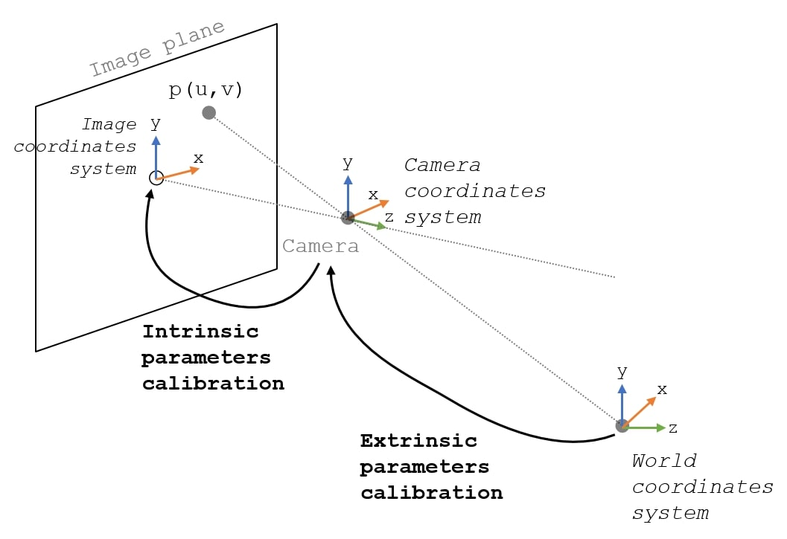
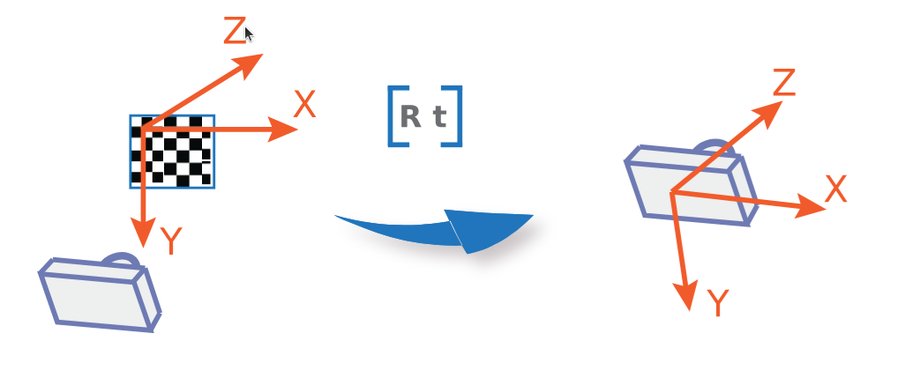
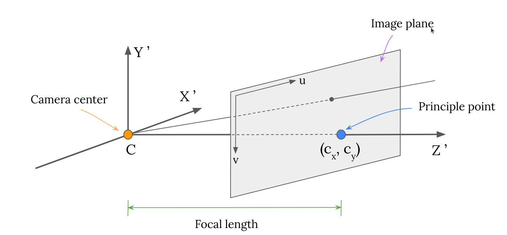
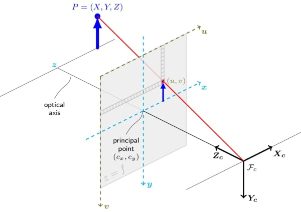
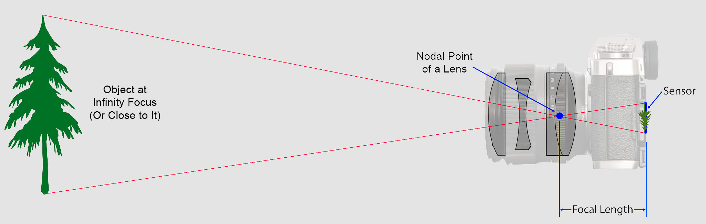
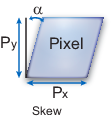

# camera-calibration

Camera calibration is the most important part when one wants to detect or calculate the distance between the AR marker / any object and the camera.

The camera is actually capturing the 3D data and transform it into 2D data. The main goal of camera calibration is to get the camera's geometrical parameters. The parameters we need for camera calibration:
- **Intrinsic parameters**: Focal length f, and Optical center
- **Extrinsic parameters**: rotation [rx, ry, rz], translation vectors [tx, ty, tz], distortion (usually barrel and pincushion distortion)

## 1. Camera calibration parameters
The calibration algorithm calculates the camera matrix using the extrinsic and intrinsic parameters. 

### a. Extrinsic parameters
The **world points** are transformed to **camera coordinates** using the extrinsic parameters. Such as: rotation *R* and translation *t*. The origin of the camera's coordinate system is at its optical center and its *x axis* and *y axis* define the image plane.

### b. Intrinsic parameters
The **camera coordinates** are projected into the image plane using the intrinsics parameters.
The intrinsic parameters include the *focal length*, the *optical center (principle point)* and *skew coefficient*

$$
K = \begin{pmatrix}
f_x & s & c_x\\
0 & f_y & c_y \\
0 & 0 & 1
\end{pmatrix}
$$

$$
= \underbrace{\begin{pmatrix}
1 & 0 & c_x \\
0 & 1 & c_y \\
0 & 0 & 1
\end{pmatrix}}_{\text{2D translation}}

\times

\underbrace{\begin{pmatrix}
f_x & 0 & 0 \\
0 & f_y & 0 \\
0 & 0 & 1
\end{pmatrix}}_{\text{2D scaling}}

\times

\underbrace{\begin{pmatrix}
1 & \frac{s}{f_x} & 0 \\
0 & 1 & 0 \\
0 & 0 & 1
\end{pmatrix}}_{\text{2D shear}}
$$

Where

- ($c_x$, $c_y$) is principle point. It maps the intersection of Optical axis with the image plane from an idealized projection. It defines the (0, 0) of the image plane.

    

- $f_x$, $f_y$ are focal length of the camera in pixel unit
    
    $f_x = F / p_x$

    $f_y = F / p_y$

    $F$: Focal length in world units, typically expressed in millimeters

    ($p_x$, $p_y$) Size of pixel in world units.

    

- $s$ is skew coefficient, which is non-zero if the image axes are not perpendicular.
    
    

    $s=f_x tanα$

## 2. Experiment
$$
\begin{pmatrix}
x \\
y \\
1
\end{pmatrix}
= P\begin{pmatrix}
X \\
Y \\
Z \\
1
\end{pmatrix}
= K R t \begin{pmatrix}
X \\
Y \\
Z \\
1
\end{pmatrix}
$$
